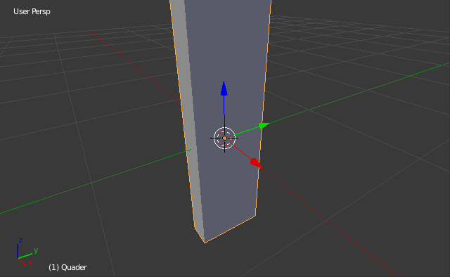

# Python Hausaufgaben 2

## Quader

Am vierten Nachmittag haben wir einen Quader programmiert. Die Aufgabenstellung war

*Definiere eine Klasse Quader und gib ihr ein paar Eigenschaften, die ein Quader haben könnte. Erzeuge einen Quader `a`. Erzeuge einen anderen Quader `b`. Erzeuge einen Quader `c`, der genau gleich aussieht wie Quader `b`. Definiere einen Quader `d`, der identisch ist mit Quader `c`.*

Danach haben wir überprüft, wie sich Änderungen an diesen Quadern auswirken.

Hausaufgabe:

* Füge eine Funktion zur Klasse hinzu, die das Volumen des Quaders ausrechnet.
* Füge eine Methode zur Klasse hinzu, die den Quader in einer Richtung dreht.

Zur Veranschaulichung ein paar Bilder:

Quader mit den Kantenlängen Länge Lx=20 (entlang der roten Achse), Breite By=6 (entlang der grünen Achse) und Höhe Hz=2 (entlang der blauen Achse).

Nach einer 90° Drehung um die x-Achse (rot):

Nach einer 90° Drehung um die y-Achse (grün):

Nach einer 90° Drehung um die y-Achse (blau):

