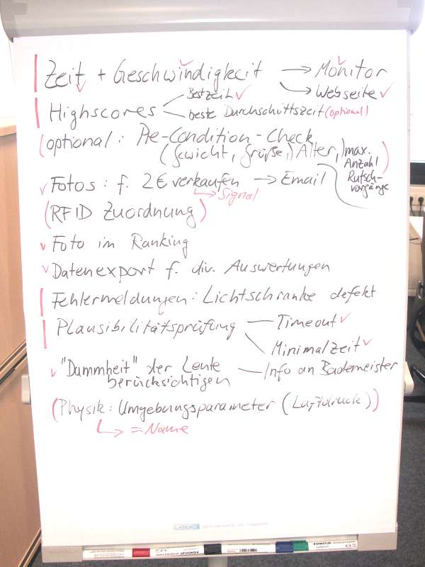
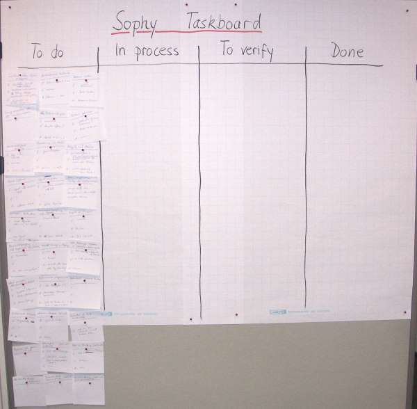
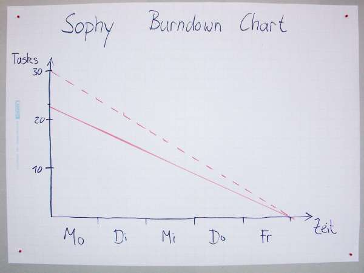

# Sophy-Preparation
Vorbereitung für die Implementierung des softwareunterstützten Physikunterrichts.

Dieses Projekt entsteht als Teil der Berufsorientierung für Gymnasiasten (BOGY) für das [Leibnitz-Gymnasium in Rottweil](https://lg.rw.schule-bw.de/home/?page_id=11268) im Schuljahr 2016/17. Als Firmenpartner steht [Mitutoyo CTL in Oberndorf](http://www.mitutoyo-ctl.de/de/karriere/ausbildungundstudium) als Ansprechpartner mit Hardware, Räumlichkeiten und Ansprechpartnern zur Verfügung.

## 1. Nachmittag

Wir haben die [Firma vorgestellt](Präsentationen/Firmenpräsentation_16_9.pptx) und uns mit den Räumlichkeiten vertraut gemacht.

Dann haben wir die Projektidee kurz vorgestellt: es soll Hardware aufgebaut werden und Software geschrieben werden, die es ermöglicht, Objekte mit Lichtschranken zu erfassen und Zeiten zwischen zwei Lichtschranken zu messen. Aufgrund dieser Messungen können dann physikalische Vorgänge (Fall, Reibung u.ä.) nachgewiesen werden.

In einem [Brainstorming](Brainstorming.md) haben wir weitere Features ausgedacht, die wir in der BOGY Woche umsetzen könnten.

Da wir die Lösung mit dem [Raspberry Pi 3](Präsentationen/Raspberry%20Hardware.pptx) umsetzen möchten, haben wir uns diesen schon mal angeschaut, aufgebaut und die Software aktualisiert (`sudo apt-get update` und `sudo apt-get upgrade`).

Hausaufgaben:

* Fotofreigabe von Eltern unterschreiben lassen
* Material für ein Physik-Experiment sammeln
* Github Account anlegen

## 2. Nachmittag

Am zweiten Nachmittag haben wir uns mit [Linux](Präsentationen/Linux.pptx) etwas vertrauter gemacht und die Shell [Bash](Präsentationen/Bash.pptx) ausprobiert. Dieses Wissen benötigen wir, um den Raspberry Pi einzurichten, die Entwicklungsumgebung zu installieren und Programme auszuführen.

Freiwillige Hausaufgabe:

* Linux in einer [virtuellen Maschine](VirtualMachine.md) ausprobieren

## 3. Nachmittag

Der dritte Nachmittag beschäftigte sich mit der Installation der Entwicklungsumgebung (IDE) [PyCharm](Präsentationen/Pycharm.pptx). Nachdem wir das geschafft hatten, haben wir uns die Programmiersprache [Python](Präsentationen/Python%20Einführung.pptx) angeschaut und erste kleine Übungsprogramme in PyCharm editiert.

Hausaufgaben:

* Pycharm für Windows [installieren](https://www.jetbrains.com/pycharm/)
* Löse die [Python Aufgaben](Hausaufgaben/Python%20Hausaufgaben%201.md), entweder in PyCharm oder auf einer Online-Seite wie [Online GDB](https://www.onlinegdb.com/online_python_debugger) oder [ideone.com](https://www.ideone.com/)

## 4. Nachmittag

Da die Python Präsentation vom dritten Nachmittag noch nicht vollständig abgearbeitet war, haben wir zunächst diese fortgeführt. Danach sind wir mit [Python Erweitert](Präsentationen/Python Erweitert.pptx) genauer auf Objekte und Klassen eingegangen.

Hausaufgaben:

* aus der Präsentation: [Python Aufgaben zum Quader](Hausaufgaben/Python%20Hausaufgaben%202.md)

## 5. Nachmittag

Für die Entwicklung unseres Programms möchten wir eine Versionskontrolle einsetzen, die uns dabei hilft

* Änderungen nachzuvollziehen
* Alte Versionen wieder herzustellen
* Als "gut" befundene Stände zu kennzeichnen
* Quellcode auszutauschen und zeitgleiche Änderungen zu entdecken

Die [Präsentation zur Versionsverwaltung](Präsentationen/Versionskontrolle.pptx) erklärt die allgemeingültigen Grundlagen. Die Folgepräsentation [Git](Präsentationen/Git%20Grundlagen.pptx) geht auf eine bestimmte Versionskontrolle ein, die auch kostenlos von Github erhältlich ist.

Hausaufgaben (freiwillig):

* [Git für Windows](https://git-scm.com/download/win) herunterladen und installieren und die Git Präsentation nochmal durcharbeiten (siehe Übungs-Folien 32 bis 36)

## 6. Nachmittag

Wir erklärten kurz die Vorgehensweise nach [Scrum](Präsentationen/Scrum.pptx). Dann kümmerten wir uns um das Sprint Planning. Wir definierten, was die Funktionen des Programms sein sollen und teilten diese Funktionen dann in Aufgaben auf. Die Aufgaben übernahmen wir ins das Taskboard. Dann haben wir die Aufgaben gezählt und das Burndown-Chart erstellt.

Brainstorming zu möglichen Funktionen:

Ein paar gute Ideen wie z.B. RFID Chips haben wir zurückgestellt, weil die Hardware noch nicht verfügbar ist o.ä. Diese Funktionen könnten in einem zukünftigen Sprint umgesetzt werden, wenn sich der Product Owner mehr Gedanken dazu gemacht hat und der Scrum Master dafür gesorgt hat, dass die nötige Ausrüstung zur Verfügung steht. Dass diese Aufgaben zurückgestellt werden ist keine Kritik an der Idee, sondern eine wirtschaftliche Entscheidung.

Aus dem Brainstorming abgeleitete Aufgaben:

Wir haben 23 nötige Tasks identifiziert, damit das Projekt erfolgreich ist sowie 7 Tasks, die wir optional umsetzen können, falls noch Zeit ist. Beide Linien haben wir dann in das Burndown-Chart übernommen.

